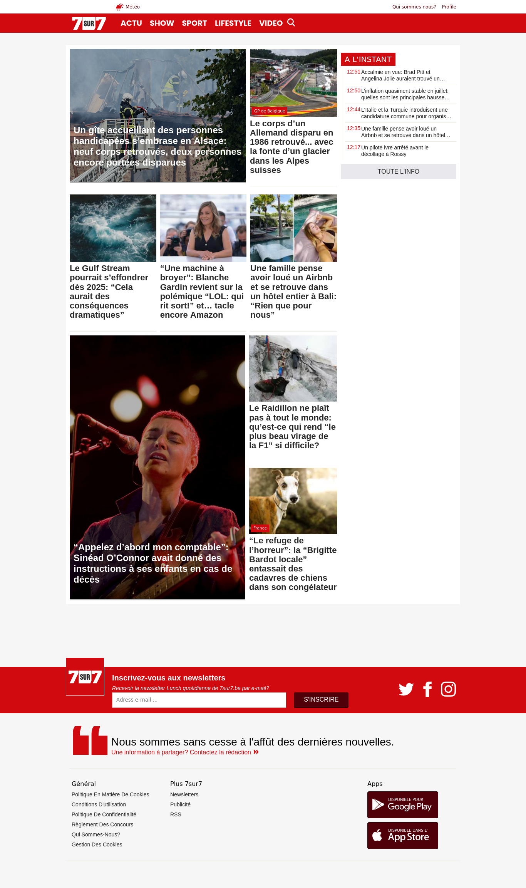
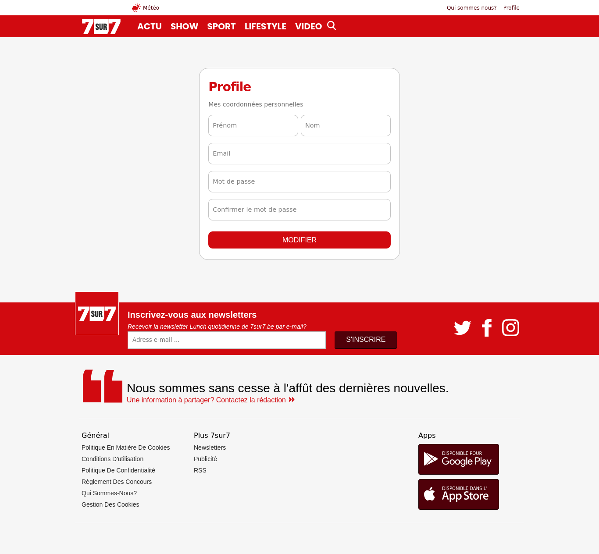
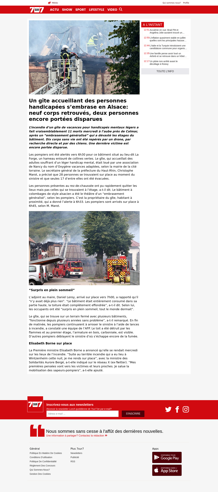

# 7sur7-clone-website

## Description

This is my version of a news website inspired by the famous news website 7sur7. It's a frontend-only build using HTML and CSS with responsive templates. The website includes three main templates: Home, User Profile, and Article.

## Features

- Utilizes semantic HTML tags like `<article>`, `<aside>`,`<nav>`,`<footer>`,`<header>`,`<main>`,`<section>`, etc... for better accessibility and SEO.
- Responsive design using CSS Grid and Flexbox properties for optimal viewing on various devices.
 
## Templates

### Home

The home page displays a list of articles with brief excerpts and images. Clicking on an article will redirect the user to the full article template.

### User Profile

The user profile template is a responsive form designed to capture user profile information. While it's currently only a design, it provides a foundation for future development.

### Article

The article template showcases a full article with its content, images, and additional details. It is accessed by clicking on an article from the home page.

## Screenshots

1. Home Page:
   

2. User Profile Template:
   

3. Article Template:
   

## Contributing

This project is currently a frontend build, but contributions are welcome. If you have ideas for new features, improvements, or bug fixes, feel free to submit a pull request.

## Acknowledgments

- The design and layout are inspired by 7sur7.
- Thanks to the creators of HTML and CSS for providing the building blocks for this project.

---
